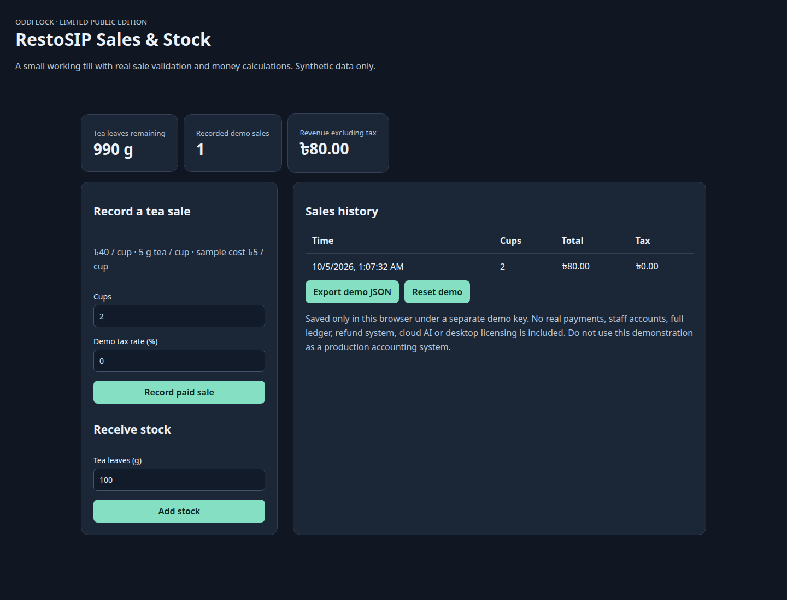

# RestoSIP — Limited Public Edition

Runnable source for a deliberately reduced portfolio edition. The full commercial product is a separate private project.

## Run locally

Requires Node.js 22.13 or newer.

```bash
npm ci
npm run dev
```

Open http://127.0.0.1:3413/. The development server binds only to localhost and refuses an occupied port.

```bash
npm run check
npm run build
npm run preview
```

The build creates a static `dist/` folder that can be hosted separately. Publishing this repository does not automatically host a website.

## Included

Working sample till: record paid tea sales, validate whole-number portions, reject insufficient stock, receive stock, calculate tax separately from revenue, view sales and export demo JSON.

## Source provenance

Original pure saleEngine, recipeEngine, orderEngine and type contracts are reused. New browser UI operates on synthetic sample ingredients and menu data.

## Limits

Production inventory lots/ledger, staff permissions, payments, refunds, desktop packaging, licensing, AI features and real customer data are excluded. This demo is not a production accounting tool.

No private accounts, credentials, owner chat logs, customer records or PC paths are bundled. No paid service is contacted. Use synthetic inputs to evaluate the demo.

## Storage and privacy

Demo stock and sales use a separate browser localStorage key. Reset clears demo records; JSON export lets you inspect your data. No browser storage or real records from the private app were copied.

## Licensing

Publication permits viewing the source; no blanket permissive licence or commercial IP transfer is granted. Third-party packages keep their licences. See `PUBLIC_SCOPE.md` and `THIRD_PARTY_NOTICES.md`.

## Demo preview



## Preparation evidence

TypeScript check and production build passed. A local browser demonstration completed without page errors. Dependency audit reported zero known advisories at preparation time (5 October 2026). No full application test suite was run. These checks do not certify production readiness.
